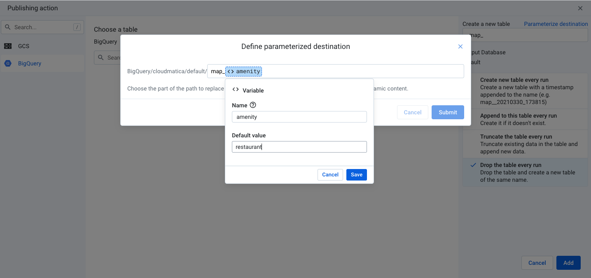
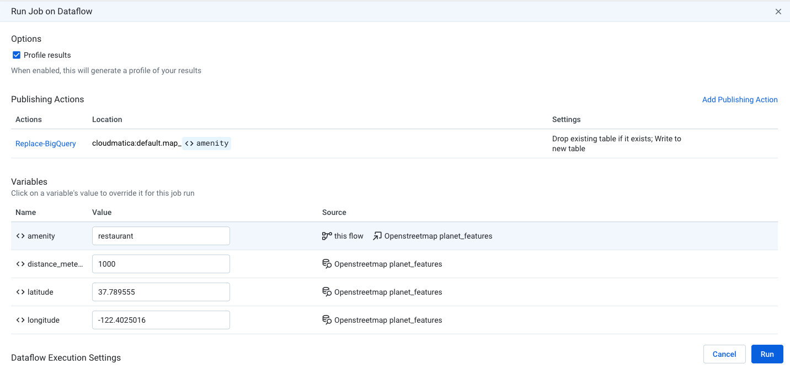

# dataprep-openstreetmap

This repository contains resources that enable you to query OpenStreetMap data by using BigQuery and Cloud Dataprep

Resources include:

* [Spreadsheet](https://docs.google.com/spreadsheets/d/1tioaPCZ4cmLno0jaFRzPwDQIRURu7O52Xvp_EeX_2x4/edit#gid=0)
* [Dataprep flow](flow_Openstreetmap.zip)

### Step 1 - Openstreetmap

Go to [openstreetmap.org](https://openstreetmap.org) and type in a location you want to use as the center of your search. Make note of the latitude and longitude.

### Step 2 - Spreadsheet

Open the spreadsheet (see link above), and choose File-->Copy to create a copy of it in your Google Drive

### Step 3 - Cloud Dataprep

Launch [clouddataprep.com](https://clouddataprep.com) and follow the prompts to set up Cloud Dataprep by Trifacta in your project

### Step 4 - Import Flow

Download the dataprep flow (see link above). In Cloud Dataprep, go to `Flows` and choose `Import flow` and choose the zip file you downloaded (i.e. `flow_Openstreetmap.zip`)

### Step 5 - Create Output

Choose the recipe and select `Create output to run`. Edit the manual destinations. Under publishing actions, add a publishing action for BigQuery, and choose a dataset and choose `Create a new table`. For the table name, type `map_` and click `Parameterize destination`. Add a variable named `amenity` with a default value of `restaurant` as shown in the screenshot below. Choose `Drop the table every run`, then `Add` and `Save settings`. If you don't need CSV output, feel free to delete it.

### Step 6 - Run Job

Select the output icon and choose `Run`. You can customize the parameters for `amenity`, `distance_meters`, `latitude` and `longitude`.

### Step 7 - Repeat

Repeat Step 5 for each amenity. Each time, a different table is written to (eg. `map_restaurant`, `map_bank`, `map_pharmacy`, etc.). You can run multiple jobs in parallel.

### Step 8 - View Results In Spreadsheet

Note that some connectors require Google Workspace Enterprise. 

Delete any existing spreadsheets that begin with `map_`. Then choose `Data`-->`Data connectors`-->`Connect to BigQuery`, then choose the dataset and tables created in the previous steps.

If you don't have access to the BigQuery data connector, you can download the output from Dataprep as a CSV file (on Cloud Storage) and import it into the spreadsheet.
